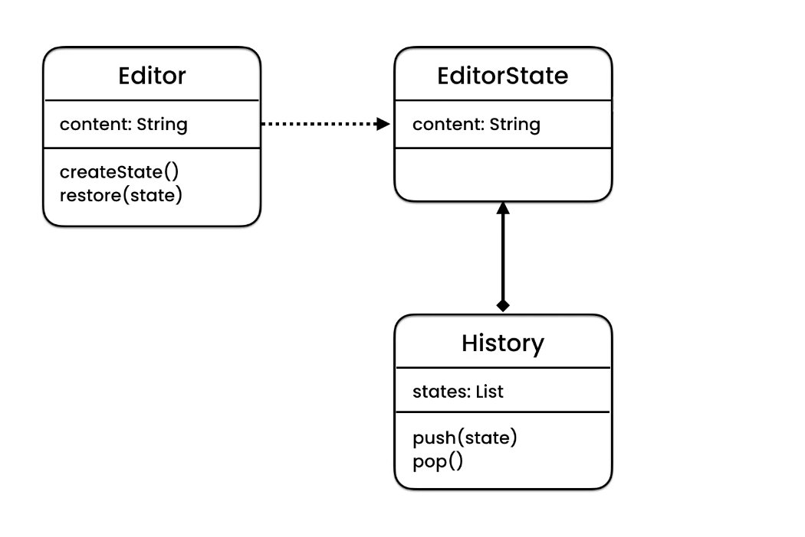

## Memento Design Pattern 
The Memento design pattern is a behavioural design pattern that provides the ability to restore an object to its previous state (undo via rollback). This pattern is used when we need to perform an operation on an object that may need to be undone later. The Memento pattern provides this undo functionality without breaking the encapsulation of the object whose state is being saved.

The Memento pattern involves three types of actor classes:

	1. Originator (Editor): This is the class that has some internal state. It can create a memento, capturing a "snapshot" of its current state, and can also restore its state from a memento.

	2. Memento (EditorState): This is essentially a value object class used to store the state of the originator. The memento class is typically designed to be immutable, so once it's created, its state cannot be changed. 

	3. Caretaker (History): This class is responsible for keeping track of mementos but never modifies mementos it keeps. The caretaker class can request a memento from the originator to save the current state, and can pass a memento back to the originator to restore a previous state.

One common example where the Memento pattern is used is the undo functionality in a text editor. When the user makes changes to the text, the editor periodically saves snapshots of the text's state (each snapshot is a memento). If the user decides to undo a series of changes, the editor can retrieve the most recent snapshot from the list of saved mementos and restore the text to that state.

## UML
The Editor class has a dependency relationship with the EditorState class and the History class is a composition of the EditorState class.

