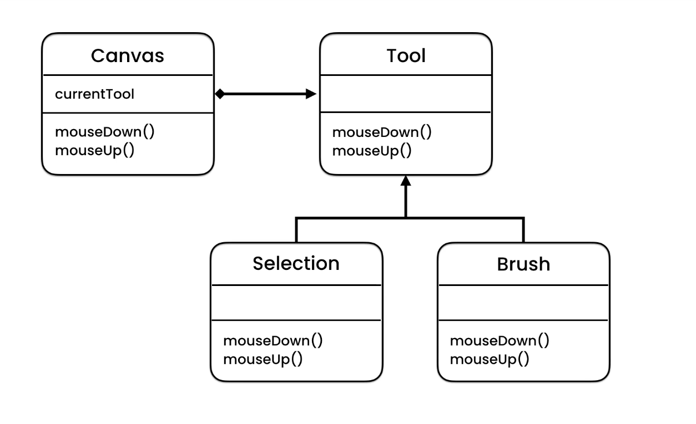

## State Design Pattern 
The State design pattern is a behavioural design pattern that allows an object to change its behaviour when its internal state changes. The object will appear to change its class.

The main idea in this pattern is to allow an object to change its behaviour without changing its class, and without the client knowing about the change. Instead of implementing all behaviour within one class, the behaviour related to a particular state is encapsulated in one class. When the state changes, the object switches to another class encapsulating the new state's behaviour.

This pattern includes several components:

	1. Context (Canvas): This is the class that has a state. This context will delegate state-specific behaviour to the current state object. It allows clients to request actions.

	2. State (Tool): This is an interface defining an interface for encapsulating the behaviour associated with a particular state of the Context.

	3. Concrete States (Selection & Brush): These classes implement the behaviour associated with a state of the Context.

The State pattern is used in situations where a system's behaviour can be in one of a specific number of states which need to behave differently, and where state-specific behaviour can be defined independently of other states, and can change at runtime. 
Examples can be seen in applications with multiple states like a media player, where the state of the player changes (e.g., playing, paused, stopped) and with each state, the behaviour of the player changes.

## UML
The Canvas class has a composition relationship with the Tool class, meaning the Canvas class incorporates the Tool class. The Tool object serves as an abstract interface for the concrete implementations of the various Tools, which inherit their behaviour from the Tool interface.

**In this pattern**:
	• The Canvas class maintains an instance of a Concrete Tool subclass that defines the current Tool.
	• The Tool class is an abstract class (or interface) that defines a common interface for all Concrete Tool implementations.
	• Concrete Tool subclasses each represent different tools and implement the Tool interface.

A change in state causes the Context (Canvas) to change its current Concrete State object (Tool). In this way, the Context class delegates state-specific behaviour to the different Concrete State objects instead of implementing state-specific behaviour directly.